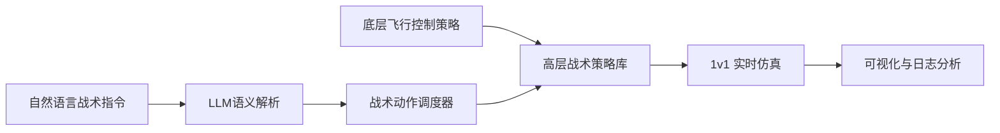
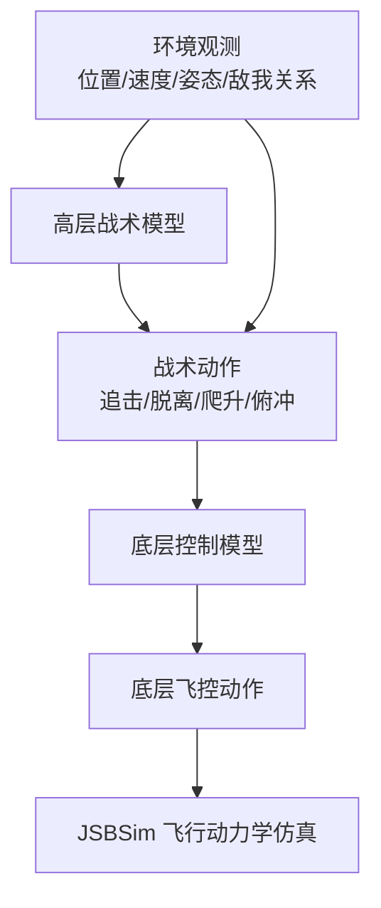
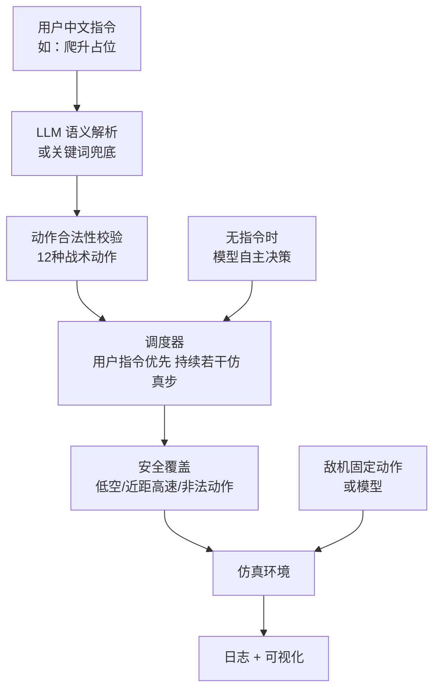

# 毕设中期汇报流程：基于分层强化学习的飞行器智能自主决策技术

> 用途：本文件用于交给 ChatGPT / PPT 工具生成中期汇报幻灯片。建议生成 16-20 页 PPT，汇报时长控制在 10-15 分钟。整体顺序固定为：研究背景 -> 研究问题与目标 -> 分层强化学习 -> Agent/LLM 融合 -> 总结。

## 一、汇报主线

本课题围绕“复杂空战场景下飞行器如何进行可训练、可解释、可交互的自主决策”展开。前半部分以 JSBSim 物理仿真环境和分层强化学习为核心，完成从底层飞行控制到高层战术决策的训练链路；后半部分在已有强化学习策略之上引入 Agent/LLM 调度层，使自然语言战术指令能够映射到受约束的战术动作空间，并在 Tacview 中形成可视化的人在回路闭环演示。

一句话概括：

```text
不是让 LLM 直接控制飞机，而是让 LLM/Agent 负责理解人类战术意图，
再调用已经训练好的分层强化学习策略执行飞行动作。
```

## 二、PPT 建议结构

| 页码 | 模块 | 标题建议 | 重点表达 |
| --- | --- | --- | --- |
| 1 | 封面 | 基于分层强化学习的飞行器智能自主决策技术 | 课题名称、姓名、导师、学院、汇报时间 |
| 2 | 研究背景 | 智能空战决策的研究背景 | 空战对抗复杂、实时性强、状态空间连续、人工规则难覆盖 |
| 3 | 研究背景 | 从传统控制到智能自主决策 | 传统规则/控制方法与强化学习方法的差异 |
| 4 | 研究问题与目标 | 本课题要解决的问题 | 连续飞控难学、高层战术难解释、人机指令难接入 |
| 5 | 研究问题与目标 | 总体研究目标与技术路线 | JSBSim + 分层 RL + Tacview + Agent/LLM |
| 6 | 分层强化学习 | 仿真平台与任务体系 | SingleControl、SingleCombat、MultipleCombat、Tacview |
| 7 | 分层强化学习 | 分层决策架构 | 高层战术动作 -> 底层航向/高度/速度控制 -> JSBSim |
| 8 | 分层强化学习 | 12 类战术动作设计 | 纯追击、提前量追击、滞后追击、脱离、Yo-Yo 等 |
| 9 | 分层强化学习 | 训练与推理链路 | PPO/MAPPO、自博弈、actor_latest.pt、actor_heading.pt |
| 10 | 分层强化学习 | 已完成的工程工作量 | 场景配置、任务改造、动作空间、低层策略调用、测试 |
| 11 | Agent/LLM 融合 | 为什么引入 Agent/LLM | 弥补 RL 策略“可交互性弱、自然语言不可直接操控”的问题 |
| 12 | Agent/LLM 融合 | Agent/LLM 融合架构 | LLM 解析、关键词兜底、调度器、安全约束、RL fallback |
| 13 | Agent/LLM 融合 | 人在回路战术调度 Demo | 输入中文指令，临时接管；无指令时 actor 自主决策 |
| 14 | Agent/LLM 融合 | 可视化与日志闭环 | Tacview 实时可视化、JSONL 日志、敌机固定动作/模型 |
| 15 | 创新点 | 工作量与创新点总结 | 分层战术动作、受约束 LLM 调度、人机闭环、可解释日志 |
| 16 | 总结 | 当前进展与后续计划 | 已完成、待完善、实验评估方向 |

## 三、研究背景

### Slide 2：飞行器自主决策的研究背景

建议画面：
- 左侧：飞行器空中对抗示意图或 Tacview 轨迹截图。
- 右侧：列出“高动态、强对抗、连续状态、实时决策、不确定环境”。

讲述要点：
- 在飞行环境里，飞行器需要根据相对距离、速度、高度、姿态和敌机机动实时决策。
- 传统规则方法依赖专家经验，面对复杂动态场景时可扩展性不足。
- 强化学习适合处理连续交互决策问题，但直接学习底层飞控动作会导致训练难度大、策略解释性弱。
- 因此，采用“分层强化学习 + 物理仿真 + 人机交互”的路线，把复杂问题拆成底层控制和高层战术两个层次。

可放在 PPT 上的简短文字：

```text
核心背景：空战自主决策需要在连续、高动态、强对抗环境中实时选择动作。
研究难点：动作空间复杂、训练样本成本高、策略可解释性和人机交互能力不足。
```

### Slide 3：从传统控制到智能自主决策

建议画面：
- 用三段横向流程表示：规则控制 -> 强化学习策略 -> Agent/LLM 调度融合。

讲述要点：
- 传统控制更擅长稳定跟踪和确定性控制。
- 强化学习可以通过试错训练获得对抗策略，但随机性较强。
- Agent/LLM 不替代强化学习策略，而是作为上层“意图理解与任务调度接口”，提升系统可交互性和可解释性。

PPT 可用表达：

```text
不是单纯训练一个空战模型，而是构建“可训练、可调度、可展示”的自主决策原型系统。
```

## 四、研究问题与目标

### Slide 4：本课题要解决的问题

建议使用“三个问题”布局：

1. 连续飞控动作难以直接学习  
   飞机姿态、速度、高度等状态连续变化，直接输出舵面和油门动作训练成本高。

2. 高层空战策略需要语义化表达  
   “追击、脱离、爬升占位、防御转弯”等战术语义更适合展示和分析。

3. 强化学习策略缺少自然语言交互入口  
   训练好的 actor 能自主推理，但用户难以通过一句话临时干预战术行为。

### Slide 5：总体研究目标与技术路线

总体目标：

```text
构建一个面向航电智能化的分层强化学习自主决策系统，
并在其上实现自然语言战术调度与实时可视化验证。
```

技术路线建议用 Mermaid 图表达：



目标拆解：
- 建立仿真与训练链路。
- 训练底层航向/高度/速度控制策略。
- 构建高层 12 类战术动作空间。
- 实现 1v1 战术层 actor 的自主决策。
- 引入 Agent/LLM 层，使中文战术指令能够临时接管 RL actor。
- 通过 Tacview 和日志形成可展示、可复盘的闭环。

## 五、分层强化学习

### Slide 6：仿真平台与任务体系

项目已有任务体系：
- 底层单机控制任务：用于训练航向、高度、速度控制。
- 单机1v1对抗任务：支持跟飞、发射导弹、躲避导弹。
- 多机对抗任务：可作为后续扩展。
- 视景工具：用于实时遥测和轨迹复盘。

建议强调工作量：
- 阅读并梳理了项目训练链路和仿真链路。
- 基于现有 JSBSim 环境定位任务、动作空间、策略加载、可视化输出的关键接口。
- 将毕设核心从“单一模型训练”扩展为“仿真、训练、对抗、交互、可视化”的系统化原型。

### Slide 7：分层决策架构

核心思想：

```text
高层策略不直接控制飞行器，而是输出战术动作；
低层策略负责把战术目标转换为飞控动作。
```

建议图示：



汇报时可解释：
- 底层关注“怎么飞”：航向、高度、速度跟踪。
- 高层关注“采取什么战术”：追击、脱离、防御转弯等。
- 这样降低了学习难度，也让策略输出更接近空战战术语义。

### Slide 8：12 类战术动作设计

当前战术动作空间：

| 编号 | 英文名 | 中文名 | 战术含义 |
| --- | --- | --- | --- |
| 0 | PURE_PURSUIT | 纯追击 | 指向敌机当前位置追击 |
| 1 | LEAD_PURSUIT | 提前量追击 | 抢占敌机前方位置 |
| 2 | LAG_PURSUIT | 滞后追击 | 保持尾后位置，避免冲过头 |
| 3 | DISENGAGE | 脱离 | 拉开距离，摆脱不利态势 |
| 4 | CLIMB_POSITION | 爬升占位 | 通过高度获取能量优势 |
| 5 | DIVE_ACCELERATE | 俯冲加速 | 下降换取速度 |
| 6 | LEVEL_ACCELERATE | 平飞加速 | 平飞状态下增加速度 |
| 7 | LEVEL_DECELERATE | 平飞减速 | 降低速度，避免冲过头 |
| 8 | DEFENSIVE_TURN_LEFT | 左防御转弯 | 向左进行防御机动 |
| 9 | DEFENSIVE_TURN_RIGHT | 右防御转弯 | 向右进行防御机动 |
| 10 | HIGH_YOYO | 高悠悠 | 通过爬升调整能量和角度 |
| 11 | LOW_YOYO | 低悠悠 | 通过下降调整速度和角度 |

体现工作量：
- 将高层动作从抽象控制量整理为 12 个战术语义动作。
- 为每个动作补充中文名称、别名、说明和合法性校验。
- 后续 Agent/LLM 层可以稳定映射到这些动作，而不是直接输出连续控制量。

### Slide 9：训练与推理链路

建议展示训练链路：

```text
训练入口
-> 场景 YAML 配置
-> JSBSim 环境
-> TacticalHierarchicalSingleCombatTask
-> PPO actor 训练
-> actor_latest.pt
-> Demo 推理加载
```

关键模型：
- `actor_heading.pt`：底层控制器，负责执行航向/高度/速度相关飞控动作。
- `actor_latest.pt`：高层 tactical actor，输出 0-11 的战术动作编号。

中期已形成的能力：
- 可以加载训练好的高层 actor 进行 1v1 战术推理。
- 可以指定己方 actor 和敌方 actor。
- 可以将敌方设置为固定战术动作，便于做对照实验。
- 可以输出 `.acmi` 文件或连接 Tacview Advanced 实时可视化。

### Slide 10：分层强化学习部分的工作量

这一页建议突出“我做了什么”，不要只讲框架已有能力。

可表述为：

```text
围绕 1v1 TacticalHierarchySelfplay 路径，我完成了战术层动作语义化、actor 推理加载、
安全约束接入、日志记录和 Tacview 演示闭环，为后续 Agent/LLM 融合提供了稳定接口。
```

具体工作量：
- 梳理 JSBSim 环境、任务、训练脚本、模型保存目录和 Tacview 渲染流程。
- 围绕 `TacticalHierarchySelfplay` 路径构建 12 类高层战术动作。
- 保持高层战术 actor 与底层 `actor_heading.pt` 的分层调用关系。
- 增加动作合法性校验和安全覆盖逻辑，避免非法动作直接进入环境。
- 增加命令构造、参数校验和单元测试，保证 demo 可重复运行。

## 六、Agent/LLM 融合

### Slide 11：为什么引入 Agent/LLM

强化学习 actor 的特点：
- 优点：推理速度快、适合闭环控制、能在仿真环境中自主决策。
- 不足：缺少自然语言交互能力，难以让用户用“爬升占位”“减速避免冲过头”等指令临时干预。

LLM/Agent 的作用：
- 不是替代飞控策略。
- 不是直接输出舵面、油门或连续飞控动作。
- 而是作为“战术意图理解与策略调度层”，把用户中文指令转成有限、可校验的 tactical action id。

PPT 可用一句话：

```text
LLM 负责理解“想做什么”，强化学习负责执行“怎么飞”。
```

### Slide 12：Agent/LLM 融合架构

建议架构图：



核心模块：
- `tactical_actions.py`：定义 12 类战术动作、中文名、别名和编号校验。
- `tactical_parser.py`：LLM 固定 JSON 输出；失败时关键词兜底。
- `tactical_policy.py`：加载 `actor_latest.pt`，维护 GRU 隐状态，确定性输出动作编号。
- `tactical_scheduler.py`：人工指令优先，接管 `hold_steps` 后恢复 actor。
- `tactical_safety.py`：对人工动作和 actor 输出统一做安全覆盖。
- `agent_tactical_1v1_demo.py`：完整运行 1v1 demo 主循环。

### Slide 13：人在回路战术调度 Demo

Demo 逻辑：

```text
没有输入新指令：
    己方使用 --actor-path 的 actor_latest.pt 自主输出动作

输入中文战术指令：
    LLM/关键词解析为 tactical action id
    人工动作接管 hold_steps 个环境步
    接管结束后恢复 actor fallback
```

示例指令：

```text
爬升占位
向左防御转弯
减速避免冲过头
脱离
```

终端日志含义示例：

```text
[step 0117] source=manual action=4:爬升占位 actor=1:提前量追击
```

解释：
- `source=manual`：当前执行的是人工自然语言指令。
- `action=4:爬升占位`：最终进入环境的己方战术动作。
- `actor=1:提前量追击`：如果没有人工接管，RL actor 原本建议的动作。

### Slide 14：可视化与日志闭环

可展示内容：
- `--render-mode txt`：生成 ACMI 文件，后续可用 Tacview 打开复盘。
- `--render-mode real_time`：连接 Tacview Advanced，实时观察轨迹。
- `--log-path`：输出 JSONL 日志，记录每一步动作来源、actor 输出、最终动作、安全覆盖原因、奖励和 done 状态。

敌机设置：
- `--enemy-action`：敌机使用固定战术动作，如 `PURE_PURSUIT`，便于做对照。
- `--enemy-path`：敌机加载另一个 tactical actor；默认复用 `--actor-path`。

推荐演示命令：

```powershell
python scripts/agent/agent_tactical_1v1_demo.py `
  --render-mode real_time `
  --status-interval 0 `
  --hold-steps 10
```

固定动作敌机对照命令：

```powershell
python scripts/agent/agent_tactical_1v1_demo.py `
  --render-mode real_time `
  --enemy-action PURE_PURSUIT `
  --status-interval 0
```

建议 PPT 画面：
- 一张 Tacview 轨迹截图。
- 一张终端输入自然语言指令的截图。
- 一张 JSONL 日志字段示意图。

## 七、创新点与工作量表达

### Slide 15：创新点总结

创新点建议表述为“工程实现型 + 系统融合型”，不要过度声称算法理论创新。

1. 分层强化学习战术动作语义化  
   将空战决策拆分为高层战术动作和底层飞控执行，使策略输出更便于解释和展示。

2. 面向自然语言的受约束战术调度  
   LLM 只在 12 类战术动作空间内选择，不直接控制连续飞控动作，降低了幻觉输出带来的安全风险。

3. 人工指令优先、空闲 actor fallback 的混合自治机制  
   用户有指令时可临时接管，没有指令时系统恢复强化学习 actor 自主决策，体现人在回路智能决策。

4. 统一安全覆盖机制  
   人工指令和 actor 输出都经过低空、近距高速和非法动作检查，保证调度层不会绕过安全边界。

5. 可视化与可复盘闭环  
   通过 Tacview 和 JSONL 日志把自然语言指令、RL actor 建议、最终动作和仿真轨迹关联起来，便于论文分析和现场展示。

工作量建议分三类讲：
- 算法侧：分层强化学习路径、战术动作空间、PPO actor 推理、敌我策略对抗。
- 系统侧：Agent/LLM 解析、调度器、安全模块、命令构造、日志和可视化。
- 验证侧：单元测试、demo 命令、Tacview 演示、对照敌机配置。

## 八、总结

### Slide 16：当前进展

当前已完成：
- 完成 JSBSim 空战仿真框架和训练链路梳理。
- 完成 1v1 战术分层路径的核心设计和 demo 化封装。
- 构建 12 类战术动作空间，并与底层飞控 actor 对接。
- 实现 `actor_latest.pt` 推理加载和无指令自主决策。
- 实现自然语言指令到 tactical action id 的解析。
- 实现人工接管、接管保持、actor fallback 恢复。
- 实现敌机固定动作和敌机 actor 两种对抗模式。
- 实现 Tacview 实时可视化和 JSONL 日志复盘。

### Slide 17：存在问题与下一步计划

当前限制：
- 目前重点是 1v1 无武器战术调度，尚未扩展到 2v2 和导弹攻防。
- LLM 当前只负责战术动作选择，不做复杂任务链规划。
- 中期阶段重点展示闭环能力，胜率提升还需要后续系统性实验验证。

下一步计划：
- 完善 1v1 场景下不同敌机策略的对照实验。
- 统计人工接管前后轨迹变化、奖励变化和动作分布。
- 将 Tacview 轨迹截图和日志分析整理为论文实验材料。
- 扩展到导弹场景或多机协同场景，但保持分层 RL 为核心决策模块。
- 完善 Agent 系统界面，把训练、评估、可视化和自然语言调度统一到更完整的原型系统。

### Slide 18：结尾页

推荐结尾表述：

```text
本课题当前已形成“分层强化学习决策核心 + Agent/LLM 战术调度接口 + JSBSim/Tacview 可视化验证”的中期原型。
后续将围绕对照实验、轨迹分析和复杂场景扩展，进一步验证系统的自主决策能力和人机交互价值。
```

## 九、交给 ChatGPT 制作 PPT 的提示词

可以把下面这段和本文一起发给 ChatGPT：

```text
请根据我提供的 Markdown 文档制作一份中文硕士毕设中期汇报 PPT 大纲。
要求：
1. 按照“研究背景 -> 研究问题与目标 -> 分层强化学习 -> Agent/LLM融合 -> 总结”的顺序组织。
2. 总页数控制在 16-20 页。
3. 风格偏学术汇报，不要做成商业路演风格。
4. 每页给出标题、页面要点、建议图示、讲稿备注。
5. 重点突出我的工作量和创新点：12 类战术动作、分层强化学习、自然语言战术调度、actor fallback、安全覆盖、Tacview 可视化。
6. 不要声称 LLM 直接提升空战胜率；应表述为提升人机交互性、策略可调用性和演示可解释性。
```

## 十、汇报时建议强调的边界

为了避免中期答辩中过度承诺，建议这样回答可能的问题：

| 老师可能问 | 建议回答 |
| --- | --- |
| LLM 是否直接控制飞机？ | 不直接控制。LLM 只把自然语言映射到有限的战术动作编号，实际飞控仍由分层强化学习策略和底层控制器完成。 |
| Agent/LLM 是否提高了胜率？ | 中期阶段不把胜率提升作为主要结论，当前强调人机交互、策略调度和可解释展示；胜率对比会作为后续实验。 |
| 为什么要分层？ | 直接输出连续飞控动作训练难度高，分层后高层负责战术语义，底层负责稳定执行，便于训练、解释和安全约束。 |
| 你的工作量体现在哪里？ | 包括战术动作空间设计、策略推理封装、自然语言解析、调度器、安全覆盖、敌机配置、日志、Tacview demo 和测试。 |
| 后续如何扩展？ | 先完善 1v1 对照实验，再扩展导弹任务或 2v2，多智能体部分仍以现有 RL 框架为核心。 |

